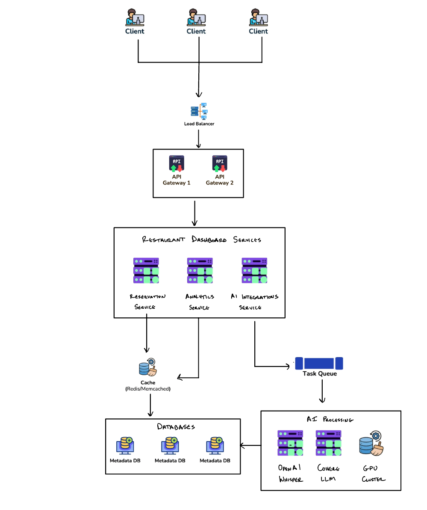

# Restaurant Dashboard

Restaurant dashboard is Streamlit web app to help restaurant staff (front-of-house) servers manage and analyze upcoming diner reservations, highlighting special requirements and integrating AI capabilities for enhanced insights.

## Video Demo

[](https://www.youtube.com/watch?v=uQ1ctliWnkk)

---

## Restaurant Dashboard Components 

The application has been organized into modular components for better readability and maintenance:

### 1. Data Loading and Preparation
- Organizes diner reservations into buckets of data based on date range so dashboard can show 10-20 reservations at a time for further analysis and general overview 
- Create tables to display reservation data of diners 
   -  Master Table, Dietary Restrictions Table, Special Occasions Table
-  Fine-dining-dataset.json is augmented to add more detail upon each diner reservation
- The following fields are included:
   - is_VIP: boolean if customer is VIP 
   - dietary_information: dietary restrictions or preferences 
   - special_occasion: ie) anniversary, birthday, proposal, business meeting 
   - other_info: usually additional information regarding special occasion or any additional things that customer needs 
   - returning_customer: customers last experience at restaurant

### Original Diner Reservation
```json
{
  "name": "Emily Chen",
  "reviews": [
    {
      "restaurant_name": "French Laudure",
      "date": "2023-11-15",
      "rating": 5,
      "content": "I visited last autumn, and it was unforgettable. They crafted a special gluten-free tasting menu for me, and the dessert trolley blew me away. The staff even chatted enthusiastically about a local art exhibit, making the whole experience feel personal."
    }
  ],
  "reservations": [
    {
      "date": "2024-05-20",
      "number_of_people": 4,
      "orders": [
        {
          "item": "Duck Confit",
          "dietary_tags": ["gluten-free"],
          "price": 45.0
        },
        {
          "item": "Salmon Tartare",
          "dietary_tags": ["nut-free"],
          "price": 32.0
        }
      ]
    }
  ],
  "emails": [
    {
      "date": "2024-05-18",
      "subject": "Gluten-Free Options + Additional Guest",
      "combined_thread": "Hello, I'm thrilled to return to French Laudure on May 20th. Since my cousin decided to join us, can we adjust our table for one more person? Also, I'd love details on the gluten-free amuse-bouche if possible. Thanks!"
    }
  ]
}
```

### Augmented Diner Reservation
```json
{
  "name": "Emily Chen",
  "reviews": [
    {
      "restaurant_name": "French Laudure",
      "date": "2023-11-15",
      "rating": 5,
      "content": "I visited last autumn, and it was unforgettable. They crafted a special gluten-free tasting menu for me, and the dessert trolley blew me away. The staff even chatted enthusiastically about a local art exhibit, making the whole experience feel personal."
    }
  ],
  "reservations": [
    {
      "date": "2024-05-20",
      "number_of_people": 4,
      "orders": [
        {
          "item": "Duck Confit",
          "dietary_tags": ["gluten-free"],
          "price": 45.0
        },
        {
          "item": "Salmon Tartare",
          "dietary_tags": ["nut-free"],
          "price": 32.0
        }
      ]
    }
  ],
  "emails": [
    {
      "date": "2024-05-18",
      "subject": "Gluten-Free Options + Additional Guest",
      "combined_thread": "Hello, I'm thrilled to return to French Laudure on May 20th. Since my cousin decided to join us, can we adjust our table for one more person? Also, I'd love details on the gluten-free amuse-bouche if possible. Thanks!"
    }
  ],
  "is_VIP": false,
  "dietary_information": "Gluten-free, nut-free",
  "special_occasion": "",
  "other_info": "Requested details on a gluten-free amuse-bouche and an extra seat for her cousin.",
  "returning_customer": "They crafted a special gluten-free tasting menu and the dessert trolley was amazing; staff made it feel personal."
}
```

### 2. UI Components 
- **Main Dashboard Structure**
   - Title, description, Smart Inbox sidebar, statistics section, 3 tables of data 
- **Interactive Components**
   - Date Range Selections, Expandable Tables Smart Inbox, Morning Huddle Transcription

### 3. AI Integrations 
- **Diner Follow-Up Analysis**
   - Takes reservation information along with email information of all diners in date bucket and leverages LLM to determine which customers need a follow up with server ie) photography permissions or addition to party size
   - Results are stored in Smart Inbox on sidebar, inspiration from S&T demo
- **Morning Huddle Audio Analysis**
   - User uploads audio file of morning huddle, then transcripted to text using OpenAI’s whisper model
   - Transcription sent to Cohere LLM which summarizes meeting and extracts action items for servers to complete 

### 4. Performance Optimizations 
- **Caching**: smart inbox results caches in session state to avoid redundant API calls ie) one you select a bucket and smart inbox is generated, if you switch and go back, results are still saved, unless you click the analyze button
- **Parallel Processing**: analyze diner bucket data in smart inbox using joblib to process tasks faster

## Features

- **Reservation Management**: View and filter reservations by date range
- **Smart Inbox**: AI-powered follow-up recommendations
- **Audio Transcription**: Convert morning huddle recordings to text
- **Data Analysis**: Statistics and visualizations for each date bucket
- **Specialized Views**: Dietary restrictions and special occasions tables

---

## System Design Diagram


---

## Running the Application
1. Create and activate the conda environment:
```bash
conda env create -f environment.yaml
conda activate restaurant-dashboard
```

2. Run the Streamlit app:
```bash
streamlit run restaurant_dashboard/restaurant_dashboard_app.py
```

## API Keys

The application uses two external APIs:

1. **Cohere API**: For analyzing diner data and transcripts
   - Set with environment variable `COHERE_API_KEY`

2. **OpenAI API**: For audio transcription
   - Set with environment variable `OPENAI_API_KEY`
